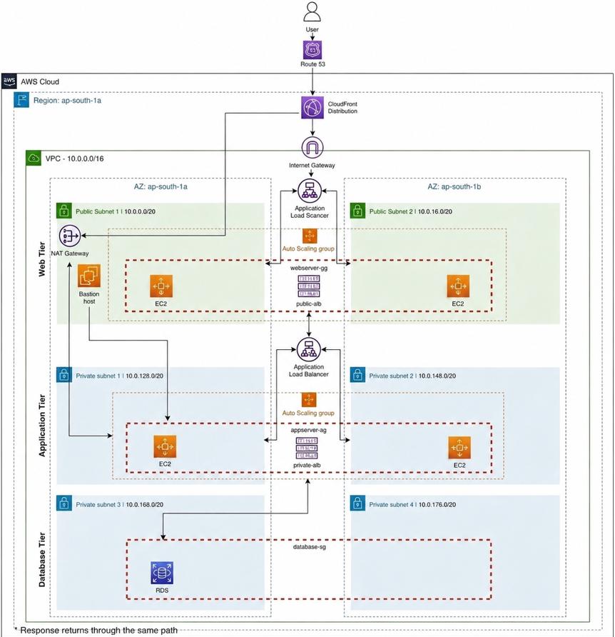
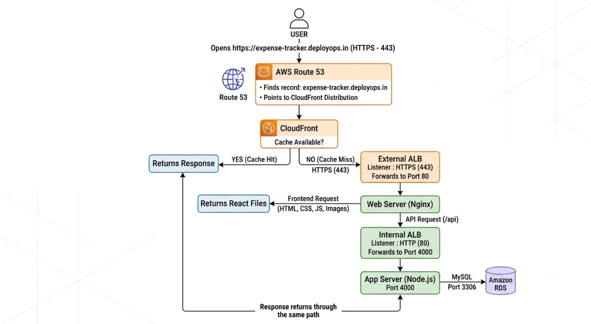
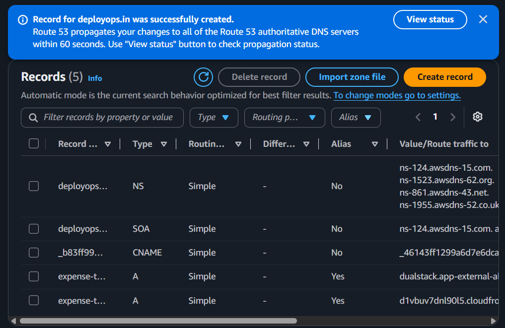
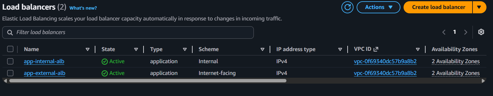
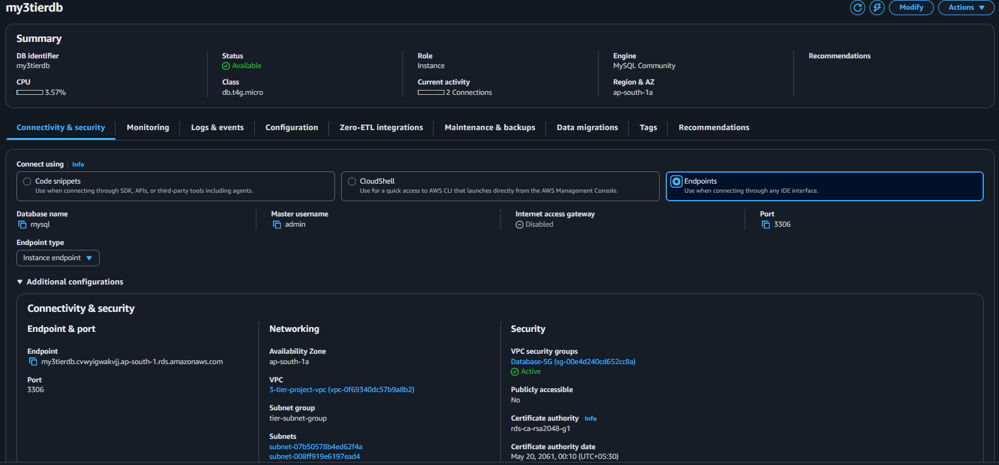
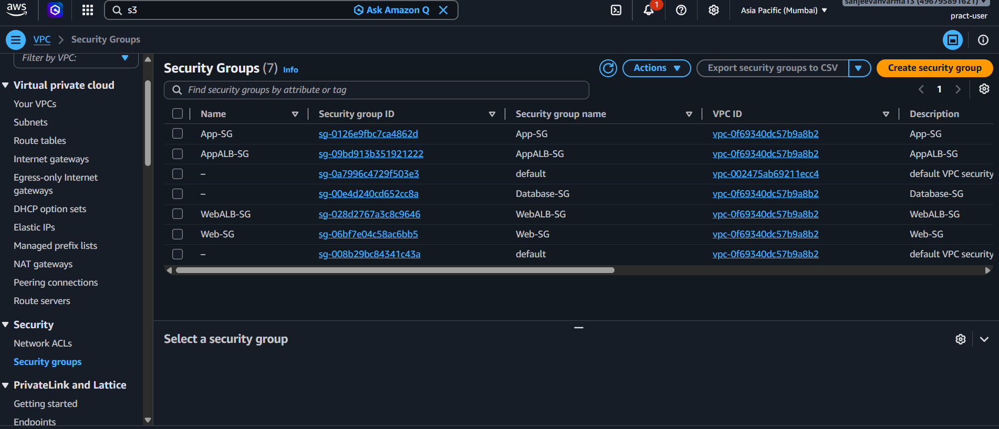
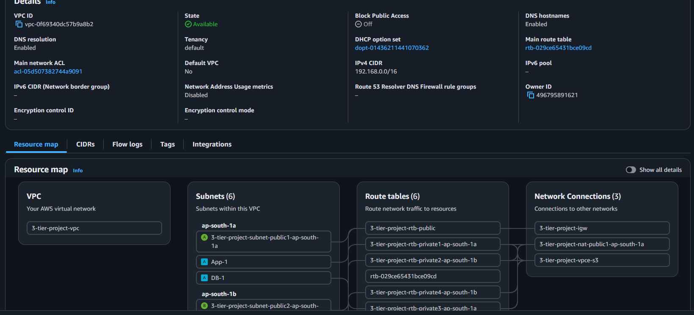
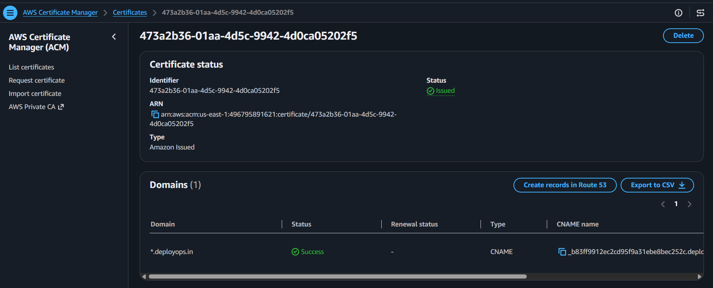

# Aws-3-Tier-Architecture-Expense-Tracker
Production-style 3-Tier Expense Tracker Application deployed on AWS using VPC, EC2, ALB, RDS, CloudFront, Route 53, Auto Scaling and ACM.

This project demonstrates a *production-style AWS 3-tier architecture** for an Expense Tracker application. The application is deployed on AWS using a custom VPC with public and private subnets, load balancers, auto scaling, and a managed MySQL database to build a secure, scalable, and highly available web application.

---
#  Architecture

---

 ☁️ AWS Services Used

- Amazon VPC – Created a secure network with public and private subnets.
- Amazon EC2 – Hosted the Web Tier (Nginx) and Application Tier (Node.js).
- Amazon S3 – Stored the application source code.
- Application Load Balancers (External & Internal) – Distributed traffic across the Web and Application tiers.
- Amazon RDS (MySQL) – Hosted the application database.
- Auto Scaling Groups – Automatically scaled EC2 instances based on demand.
- Amazon CloudFront – Improved performance by caching content closer to users.
- Amazon Route 53 – Connected the custom domain to CloudFront.
- AWS Certificate Manager (ACM) – Enabled secure HTTPS communication.
- IAM Role & AWS Systems Manager (Session Manager) – Provided secure AWS permissions and EC2 access without SSH.

---

⭐ Key Features

- Production-style AWS 3-Tier Architecture
- Custom VPC with Public & Private Subnets
- External & Internal Application Load Balancers
- HTTPS enabled using AWS Certificate Manager (ACM)
- CloudFront CDN with Route 53 Custom Domain
- Node.js Application with Amazon RDS (MySQL)
- Auto Scaling Groups with Launch Templates
- Secure EC2 access using IAM Roles and Session Manager
- Highly Available deployment across Multiple Availability Zones

---

🔄 Request Flow

User
   │
https://expense-tracker.deployops.in
   │
Route 53
   │
CloudFront
   │
Internet Gateway
   │
External ALB
   │
Web Server (Nginx)
   │
Internal ALB
   │
Application Server (Node.js)
   │
Amazon RDS (MySQL)

---

## 📸 Project Screenshots

- Architecture Diagram

- Workflow

- Working Application

- Route 53

-  Application Load Balancers

- Amazon RDS

- Security Groups

- VPC

- Target Groups

- ACM

- Subnets

---

🚀 Deployment Summary

- Created a custom VPC with public and private subnets.
- Configured Route Tables, Internet Gateway, and NAT Gateway.
- Created Security Groups and IAM Roles.
- Uploaded application code to Amazon S3.
- Deployed Amazon RDS MySQL.
- Configured the Node.js Application Tier.
- Configured the Internal Application Load Balancer.
- Deployed the Nginx Web Tier.
- Configured the External Application Load Balancer.
- Implemented Auto Scaling Groups and Launch Templates.
- Configured CloudFront and Route 53.
- Enabled HTTPS using AWS Certificate Manager (ACM).

---

 💻 Technologies Used

- AWS
- Amazon EC2
- Amazon VPC
- Amazon RDS (MySQL)
- Amazon S3
- Application Load Balancer
- CloudFront
- Route 53
- Auto Scaling
- IAM
- AWS Systems Manager
- Nginx
- Node.js
- MySQL
- Linux

---

📌 Note

- The application was successfully deployed and tested on AWS.
- To avoid unnecessary AWS charges, the cloud infrastructure has been terminated.
- This repository contains the application code, architecture diagrams, deployment steps, and screenshots.

---

 👨‍💻 Author
**Sanjeevan Varma**

- GitHub: https://github.com/sanjeevanvarma?tab=repositories
- LinkedIn: https://www.linkedin.com/in/sanjeevan-varma-indukuri-90943529b/
